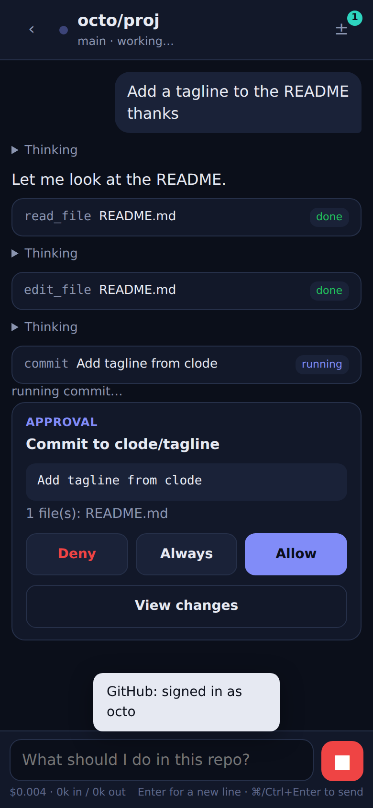
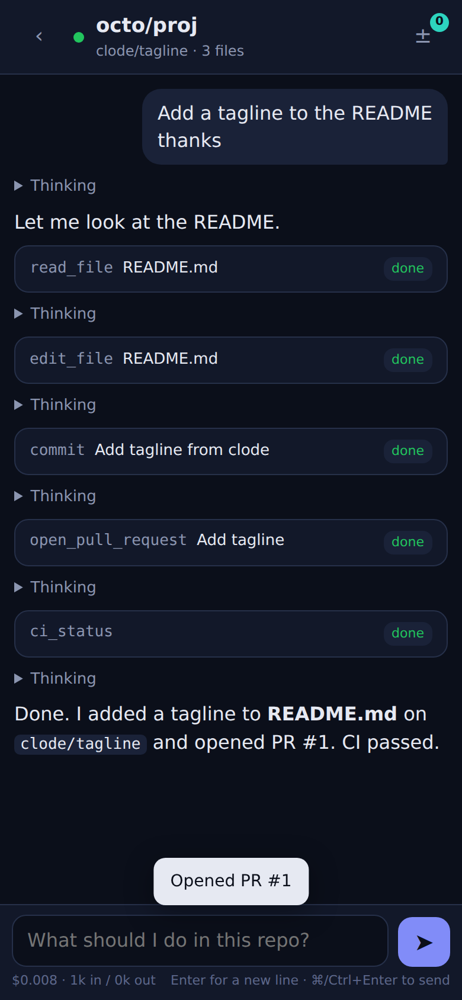

# clode

*A coding agent that lives on your phone.*

clode is a standalone app for your phone that works on your GitHub repositories with your own model key. There is no computer in the loop and no server of ours: the phone talks to Claude and to GitHub directly, edits are staged on the device, commits go straight to a branch, and the repository's own CI runs the code.

Install it once from the browser (Chrome on Android: menu → *Install app*; Safari on iPhone: Share → *Add to Home Screen*) and it behaves like any other app: its own icon, its own window, works offline for what it has already loaded.

<p>

&nbsp;

</p>

## What it does

You pick a repository and a branch and say what you want. The agent then:

1. reads the code it needs (`list_files`, `search`, `read_file`, fetched lazily from GitHub and cached on the phone),
2. makes edits (`edit_file` for exact replacements, `write_file`, `delete_file`), staged locally,
3. asks you before it **commits** or **opens a pull request**, with the diff one tap away,
4. checks **CI** on the new commit (`ci_status`: runs, jobs, failed steps, log tails when GitHub lets a browser read them) and fixes what failed,
5. asks you a question (`ask_user`) only when the answer changes the work,
6. runs small JavaScript checks in a sandboxed worker (`run_js`) when a quick calculation helps.

Everything the agent did is a card you can expand. Staged changes are a diff sheet with a commit button, so you can also commit by hand. Sessions persist on the device with their messages, cost and staged edits, so you can lock the phone and come back.

## What it needs

* **An Anthropic API key.** You pay Anthropic directly for what the agent uses; clode shows the running cost next to the composer. Default model is Claude Opus 5 at effort `xhigh`; Sonnet 5, Opus 4.8 and Haiku 4.5 are available in Settings. Requests use adaptive thinking, prompt caching, server-side compaction for long sessions, and the server-side refusal fallback on Opus 5.
* **A GitHub fine-grained token** scoped to the repositories you want the agent to touch, with Contents (read/write), Pull requests (read/write), Actions (read) and Metadata (read).

Both are stored in the browser's local storage on this device and are sent only to `api.anthropic.com` and `api.github.com`. clode has no backend. The app itself is static files.

## What it cannot do, and why

* **No shell.** A phone browser cannot run your project's build or tests. clode's answer is the same one you use for code review: commit to a branch and let GitHub Actions run it, then read the result. If a repository has no CI, clode will tell you it could not verify.
* **No long unattended runs.** Phones suspend background tabs. clode holds a screen wake lock while the agent is working and repairs the conversation if a turn was cut off, but if you lock the phone mid-run you will need to tap *Retry* when you come back. A native wrapper with a foreground service would lift this; it is not built yet.
* **Fetching arbitrary URLs** from a browser is blocked by CORS on most sites, so there is no `fetch_url` tool. Paste what the agent needs into the chat.
* **Large repositories:** the file list comes from one recursive tree call (GitHub truncates past 100,000 entries) and search reads files lazily with caps, so on a huge monorepo, point the agent at a directory.

## Run it

It is a static site. Any https host works; the repository ships a GitHub Pages workflow (`.github/workflows/pages.yml`) that publishes `clode/`. Enable it once in the repository: Settings → Pages → Source: *GitHub Actions*. The app is then at `https://<owner>.github.io/<repo>/` and installable from there.

For development, serve the folder with anything (`python3 -m http.server` in `clode/`) and open it in a phone-sized browser window. Settings → Advanced lets you point the API base URLs at fakes; `test/helpers/` contains a scripted Messages API and a small in-memory GitHub used by the tests.

```bash
cd clode
node --test test/*.test.js     # agent loop, tool schemas, workspace, diff, retries, refusal, abort
```

## Design notes

* **Strict tools.** Every tool is declared with `strict: true` and a closed schema, so arguments always validate.
* **History discipline.** Assistant content, thinking blocks included, is echoed back unchanged; tool results are returned in one user message; an aborted turn gets error results for its dangling tool calls so the next request is valid.
* **Approval is a tool boundary.** Only `commit` and `open_pull_request` gate on you. Reading and staging cannot damage anything, so they never interrupt.
* **One commit, not many pushes.** Staged files become blobs, one tree, one commit and one ref update through the Git Data API, so the branch history stays readable.

License: AGPL-3.0-or-later, like the rest of this repository.
