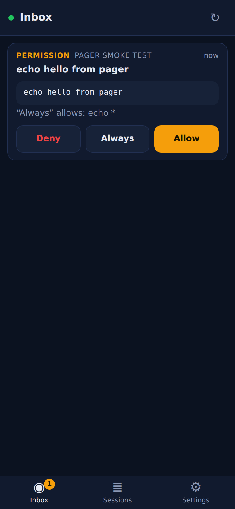
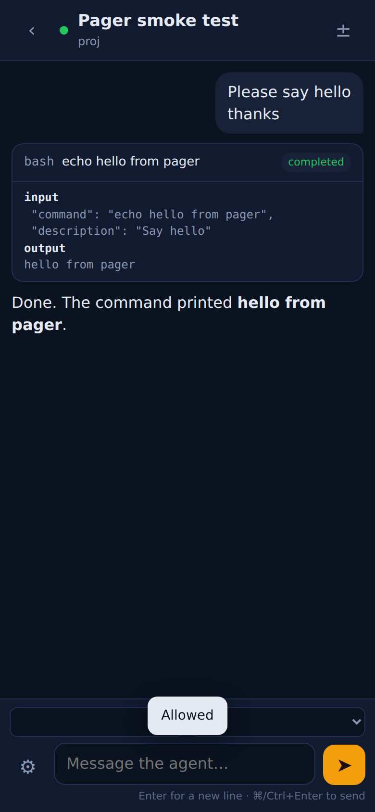

# opencode-pager

*The agent pages you.*

A mobile companion for [opencode](https://github.com/anomalyco/opencode) that is built around the one thing a phone is actually for: **being reached when the agent needs you, and answering in two taps.**

It is a tiny bridge you run next to `opencode serve`, plus an installable web app for your phone. Zero dependencies. One command.

```bash
npx opencode-pager            # next to a running `opencode serve`
```

Scan the QR code it prints. That's the whole setup.

<p>

&nbsp;

</p>

## Why this exists

By September 2026 there are at least seven "opencode mobile" clients. They are all the same shape: a full IDE crammed onto a phone, talking straight to `opencode serve` over a tunnel you set up yourself. They all leave the same four things broken, because those things are not about screens, they are about **being reached** and **being right**:

| The problem on a phone | What opencode-pager does about it |
|---|---|
| **Nothing tells you the agent is stuck.** It asked to run `rm -rf build` twenty minutes ago and has been waiting since. | Web Push the moment a permission or question has waited more than 1.5 s, when a run finishes, and when it errors. **Allow / Deny straight from the notification**, without opening the app. |
| **The stream lies.** Mobile browsers drop long-lived connections when the screen locks. The official web UI shows "Failed to send prompt" while the agent is happily running ([#12453](https://github.com/anomalyco/opencode/issues/12453)), and a client that re-attaches never sees the permission that is already pending ([#21154](https://github.com/anomalyco/opencode/issues/21154)). | Every reconnect **re-reads the truth from REST** (`/session/status`, `/permission`, `/question`) and the first event on every stream is a full inbox snapshot. Prompts go through `prompt_async` (204, done) so there is no minutes-long response to time out. Heartbeats every 15 s keep the connection honest. |
| **Everything is a chat.** The thing you need on the train is not the transcript, it is *what needs me right now*. | The home screen is an **inbox**: pending permissions and questions first, then errors, then finished runs, across all sessions. Empty inbox means "nothing needs you". |
| **The phone keyboard's Enter sends** ([#10319](https://github.com/anomalyco/opencode/issues/10319)), inputs autofocus and pop the keyboard ([#14057](https://github.com/anomalyco/opencode/issues/14057)). | Enter is a newline. Nothing autofocuses. ⌘/Ctrl+Enter or the button sends. |

Also: works on iPhone and Android from one codebase with no app store, because it is a PWA. Your code, prompts and keys never touch anyone else's server; the bridge runs on your machine and the phone talks only to it.

## How it works

```
 phone (PWA) ──https──▶ opencode-pager bridge ──http (basic auth)──▶ opencode serve
   ▲                          │  keeps the inbox from /event
   └──── Web Push ◀───────────┘  reconciles from REST on every (re)connect
```

* **Bridge** (`bin/opencode-pager.js`, Node ≥ 20 or Bun): serves the app, reverse-proxies `/oc/*` to opencode adding the server password, subscribes to opencode's event stream and maintains the inbox, streams `/pager/events` to phones with snapshot-on-connect and heartbeats, pairs devices, stores push subscriptions, and sends Web Push (VAPID + RFC 8291, implemented on WebCrypto, verified against the RFC test vector).
* **App** (`web/`): vanilla JS, no build step. Inbox, sessions, a session view with streaming text, tool cards, diffs, permission and question cards, and a composer. Service worker for offline shell and notifications.
* **Pairing**: the bridge prints a QR encoding `https://your-bridge/#pair=CODE`. The code is single-use and expires in 30 minutes; the phone gets a random bearer token (also set as an HttpOnly cookie so the service worker can act on notifications). Only SHA-256 hashes of tokens are stored.

## Setup

1. Run opencode with a password. The bridge uses the same variables:

   ```bash
   export OPENCODE_SERVER_PASSWORD=$(openssl rand -hex 16)
   opencode serve                      # http://127.0.0.1:4096
   ```

2. Run the bridge (or let it spawn opencode for you with `--spawn`):

   ```bash
   npx opencode-pager                  # listens on 0.0.0.0:4097
   ```

3. **Give the phone an https URL.** Browsers only allow push notifications and "Add to Home Screen" on https. The simplest way, and the safest, is Tailscale:

   ```bash
   tailscale serve --bg 4097           # https://<machine>.<tailnet>.ts.net
   npx opencode-pager --url https://<machine>.<tailnet>.ts.net
   ```

   A Cloudflare Tunnel or ngrok pointed at port 4097 works the same way; pass its URL with `--url` so the QR code is right. Plain http on a LAN works for everything except push and installation. You can also terminate TLS in the bridge itself with `--tls-cert` and `--tls-key`.

4. Scan the QR. On iPhone, add the page to your Home Screen (Share → Add to Home Screen) and open it from there before enabling notifications; iOS only delivers Web Push to installed web apps. On Android, Chrome offers to install it.

5. Settings → Enable notifications → Send test.

### Commands

```
opencode-pager [serve]        run the bridge (default)
  --opencode URL              opencode serve URL (default http://127.0.0.1:4096)
  --port N --host H           bridge listen address (default 4097 on 0.0.0.0)
  --url https://…             public URL the phone will use; printed in the QR
  --subject mailto:you@x      VAPID contact for push services (recommended)
  --state PATH                state file (default ~/.config/opencode-pager/state.json)
  --tls-cert F --tls-key F    serve https directly
  --spawn                     start `opencode serve` as a child process
opencode-pager pair           print a fresh pairing QR for the running bridge
opencode-pager devices        list paired devices and their push subscriptions
opencode-pager revoke ID      forget a device
opencode-pager status         bridge and opencode status
```

Environment: `OPENCODE_SERVER_PASSWORD`, `OPENCODE_SERVER_USERNAME`, `OPENCODE_URL`, `OPENCODE_PAGER_PORT`, `OPENCODE_PAGER_HOST`, `OPENCODE_PAGER_URL`, `OPENCODE_PAGER_STATE`.

## What the phone can do

* **Inbox**: allow once / always / deny a permission with the exact command or path in front of you; answer a question (single choice, multiple choice, or free text); jump into an errored or finished session.
* **Sessions**: every session with live status, last activity and the size of its diff. Start a new one.
* **Session**: streamed assistant text, collapsible tool calls with input and output, thinking, per-message errors; the session diff as a bottom sheet; permissions and questions inline; stop a running turn; pick agent and model.
* **Notifications**: Allow / Deny actions on permission notifications (Android, desktop). Tapping any notification opens the right session.
* **Offline**: the app shell and the last inbox snapshot are cached, so a glance still works with no signal; it re-syncs the moment the network is back or the app returns to the foreground.

## Security model, honestly

* The bridge is meant to be reachable only over your tailnet or a tunnel you control. It has no accounts; possession of a paired token is access to your agent, which is the same trust level as `opencode serve` itself.
* Pairing codes are 10 characters from a 31-symbol alphabet (about 50 bits), single use, expire in 30 minutes (10 when issued by `opencode-pager pair`), and pairing is rate-limited to 10 attempts per minute.
* Notification actions use a separate single-use token per notification (6-hour expiry) on top of the device cookie, so a leaked push payload cannot approve anything else.
* Admin endpoints (`pair`, `devices`, `revoke`, `status`) answer only to loopback connections without proxy headers.
* Push payloads are encrypted end to end to the browser (that is what RFC 8291 is), so Apple and Google relay ciphertext. They still see *that* you were paged, and when.
* What it does not do: end-to-end encryption between phone and bridge beyond TLS, or a hosted relay so you can skip the tunnel. A relay is the obvious next step and would follow the [Happy](https://github.com/slopus/happy) model: both ends dial out, the relay stores ciphertext only.

## Compatibility

Built and tested against opencode **1.18.27** (September 2026). The bridge understands both the current permission/question events (`permission.asked`, `question.asked`, `GET /permission`, `GET /question`) and the `v2` variants (`permission.v2.asked`, `/api/session/:id/permission/:id/reply`), and falls back from one to the other on 404, so it should survive the migration in either direction.

## Development

```bash
cd opencode-pager
node --test                              # unit + bridge tests against a fake opencode (~2 s)
OPENCODE_BIN=$(which opencode) node --test test/e2e.test.js   # real opencode + mock model
node bin/opencode-pager.js --opencode http://127.0.0.1:4096
```

The QR encoder is checked module by module against python-qrcode fixtures; the push encryption reproduces RFC 8291 Appendix A byte for byte; the end-to-end test drives a real `opencode serve` with a mock OpenAI-compatible model that asks to run `bash`, approves it through the notification-action path, and asserts the run finishes and the inbox clears.

## License

AGPL-3.0-or-later, like the rest of this repository.
